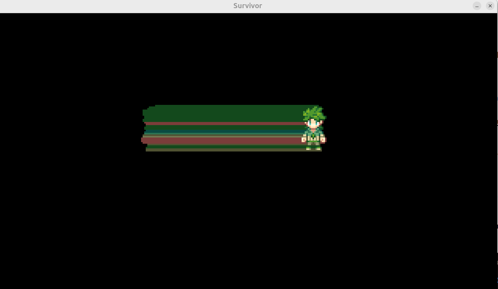

## 🟡 Vampire survivor


<br>
<br>


## 🟦 Intro


#### [3:55:55](https://youtu.be/8OMghdHP-zs?si=EaQXjYMwheIf3E4p&t=14155)

<br>


## 🫐   Player <u>Movement</u>  Implementation


## 🟡  1.  Let's Add Input and Movement

### Now, we need to focus on two important things:

- - **input** (handling the player's actions) and

- - **movement** (moving the player around).


#### These will be part of the player's update process.

<br>

```python
    def input(self):
        pass  # Here we will handle player controls (like keyboard input)

    def move(self, dt):
        pass  # Here we will move the player based on input

```

### These two methods will be called inside the `update()` method, which runs every frame to keep everything updated:

```python
    def update(self, dt):
        self.input()  # Get player input (e.g., keyboard presses)
        self.move(dt)  # Move the player based on input

```

>This way, the player’s input and movement are checked and updated every frame!


<br>
<br>

## 🟡  2. Defining the Player's Position and Movement Direction

We will be adding this 3 lines to the Player class

```python
     self.rect = self.image.get_frect(center = pos)
     self.direction = pygame.Vector2(1,0)
     self.speed = 500
     self.rect.center += self.direction * self.speed * dt
```

### `self.rect = self.image.get_frect(center=pos)`

 #### 🟢 This line creates a rectangle around our character’s image, helping Pygame know exactly where our player is on the screen.

>  #### The *`center=pos`* part means we’re placing that **square** right where we want our player to start.

#### Think of it as putting our character in their perfect starting position!


### `self.direction = pygame.Vector2(1, 0)`

####  Here, we’re defining which way our player is facing.

> #### 🌈 A Vector2(1, 0) means the player is pointed to the right.

> If we wanted them to look up or down, we could change this to something like **Vector2(0, -1)** or **Vector2(0, 1)**.

This simple line provides our character with a clear path to follow (like a reliable compass)!

<br>

## 🟤 The Movement Magic 🌟

- In the **move** method, we see this line:

```python
self.rect.center += self.direction * self.speed * dt
```


<br>


## 🟤 Add it to the code

```python
class Player(pygame.sprite.Sprite):
    def __init__(self, pos, groups):
        super().__init__(groups)
        self.image = pygame.image.load(join("../images", "player", "down", "0.png" )).convert_alpha()

        self.rect = self.image.get_frect(center = pos)


    # MOVEMENT
        self.direction = pygame.Vector2(1,0) # A Vector2(1, 0) means the player is pointed to the right.


        self.speed = 500
        # The speed is set to 500, which means the character moves quite quickly.


    def input(self):
        pass

    def move(self,dt):
        self.rect.center += self.direction * self.speed * dt
The speed is set to 500, which means the character moves quite quickly.
    def update(self, dt):
        self.input()
        self.move(dt)
```

### Output

#### 🔴 We have some movement but we can see the last frame

[]()


<br>