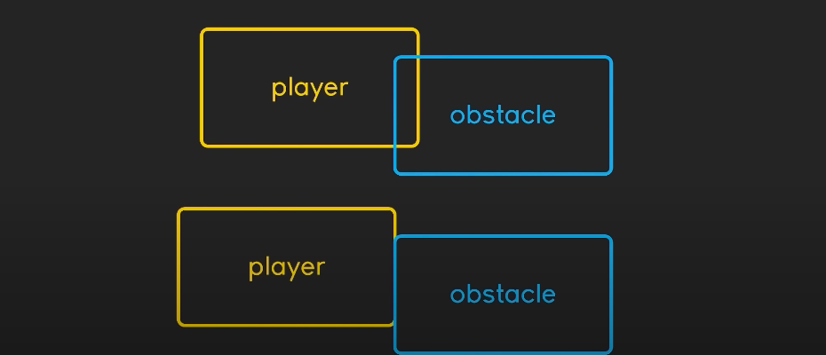
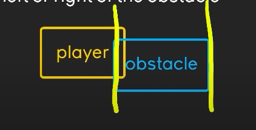

## 🟡 Vampire survivor


<br>
<br>


## 🟦 Intro


#### [4:00:25](https://youtu.be/8OMghdHP-zs?si=K8Dih6ZmFsOst1f4&t=14425)

<br>


# 🫐 🟡 <u>Collisions</u>  Implementation

#### 🌈 We previously covered this topic in our first game project. You can refer to the steps outlined [collisions](https://github.com/nadiamariduena/python-games-01/blob/beginner-00-deafult-install-and-games/0_SPACESHIP-game/RE_game-CODE_12_Debut-game_create_collision.md)  for a detailed guide.

<br>
<br>

## 🟠 Rectangular Collision Logic: Identifying Contact vs. Overlap

 **Rectangles, or "rects,"** can only tell us when they’re touching, but they don’t say what to do next.

> #### To make the game interesting, we need to use that collision info to move the player around when they hit something. Let’s make those collisions work!


<br>

>In the image below, you'll see four boxes. In the first example, the player’s box overlaps with the obstacle’s box. In the second example, the player and the obstacle are touching, but they don’t overlap.


[]()

>Images source: Master Python by making 5 games **[the new ultimate introduction to pygame]**

<br>

#### [4:01:39](https://youtu.be/8OMghdHP-zs?si=QiA4CxKXIDEjB5vb&t=14499)

## 🔴 The complication

#### When a collision happens, we can’t tell exactly where it’s occurring. It could be at the bottom, the top, or any side of the player. Check out the image below for a clearer idea!


<br>

## 🟧 Finding the Collision Side


### To figure out where the collision is happening, we need to break it down:

> ####  We <u>check for collisions separately</u>  on the horizontal (left and right) and vertical (up and down) axes.


<br>

### 🌈 let’s go one by one!

- We’ll **check from left to right** to observe how the player interacts with obstacles.

> - - This way, we can better understand the behavior of the collisions and determine how to respond to them effectively.

[4:02:40](https://youtu.be/8OMghdHP-zs?si=Uj8rhmTMwlaWYwyZ&t=14560)

[](https://youtu.be/8OMghdHP-zs?si=Uj8rhmTMwlaWYwyZ&t=14560)


<br>
<br>
<br>

---

## 🔴 Problems with this approach

### The main issue with this approach is that<u>it only works if a single object is moving</u>   (not the enemy),

<br>

> ### 🟥 for example at the moment the player can only collide with: trees, rocks and the hills (because they are static),

- ### 🔺 the player cannot collide with any of the enemies

since those are moving, the collision logic would break.

<br>

## 🟧 Collision between Two Moving Objects


### When we’re dealing with collisions between two moving objects, we need a bit more logic.

> #### Think of it like the way a [ parrot fish](https://youtu.be/zdzAUQ4juH4?si=zPQ-hA0ufLFrn9KV) creates a "bubble" around itself to protect from parasites.

This bubble is kind of like the hitbox we need for our objects. So, imagine this bubble in terms of X (left/right) and Y (top/bottom) coordinates.

When we’re checking if an enemy collides with the player, the enemy also has its own bubble.

#### 🟣  So, both the player and the enemy need these "bubbles" (hitboxes) to exchange collision information.


---

<br>
<br>
<br>

## 🟡 Guide to Setting Up Collision Detection with Moving Objects


### In this section, we'll walk through the process of adding collision detection between the player and other sprites in your game.

> #### You'll learn how to create and manage collision objects like blocks, randomize their positions and sizes, and set up a system to check for overlaps between the player and these objects.

#### 🟧 This will allow your game to respond when the player hits or interacts with obstacles.


### Summary:

- **Create sprites.py:** A file to store your block (and other) sprites.

- **Set Up Block Sprite:** Define a basic blue block (hitbox) that the player will collide with.

- **Import the Sprite:** Add the sprite class to main.py.

- **Create Instances:** Spawn several blocks (or other objects) in the game world.

- **Randomize Positions and Sizes:** Use `randint()` to make the blocks appear in random spots and with random sizes.

- **Group the Sprites:** Store the blocks in a sprite group for easy collision checking later.

<br>
<br>

<br>
<br>

# 🟦 Lets get started:

## 🟡   Set Up Your Code Structure

### Right now, we don't have anything for the player to collide with.

> - #### 🍨 To fix this, we need to add some obstacles or blocks 🧊 to collide with.

#### So, let's create a new sprite (or rectangle) that we can use for collision.


<br>


##  🟡 1.  Create the `sprites.py` File

- #### First, create a new file called `sprites.py` in your `code` folder.

> - - This file will store all your sprite classes, like the player, enemies, and other objects (such as blocks) that the player can collide with.

<br>
<br>

## 🟡 2.  Set Up a Basic Block Sprite

### Now, let’s create a basic block 🧊 (a blue rectangle) that we can use for collisions.

```python
from settings import *

class CollisionsSprite(pygame.sprite.Sprite):
    def __init__(self, pos, size, groups):
        super().__init__(groups)

        # --- a blue block surface

        self.image = pygame.Surface(size)
        self.image.fill('blue')
        self.rect = self.image.get_frect(center = pos)
```


<br>

- #### This defines a new sprite (CollisionsSprite) that represents a block.

- #### It has a position (pos), size (size), and a rectangle (rect) that will help us detect collisions.


> #### 🟤 Note: At this point, the block’s position and size will be controlled from the main game (main.py), not here in sprites.py.