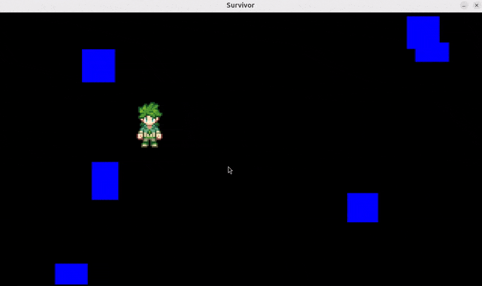
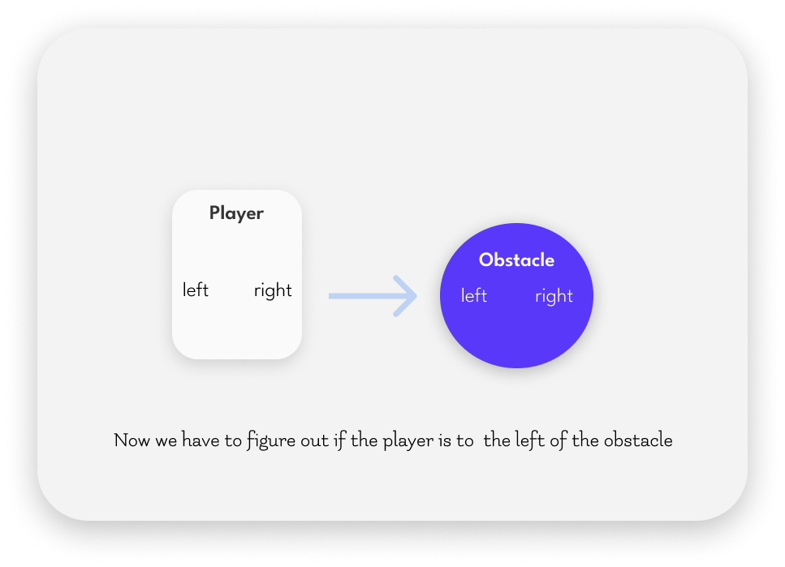
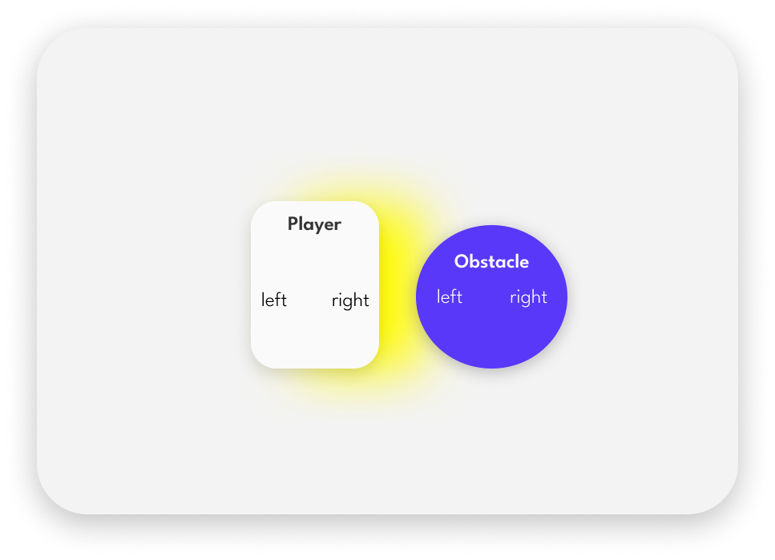

## 🟡 Vampire survivor


<br>
<br>


## 🟦 Intro


#### [4:00:25](https://youtu.be/8OMghdHP-zs?si=K8Dih6ZmFsOst1f4&t=14425)

<br>


# 🫐 🟡 <u>Collisions</u>  Implementation

#### 🌈 We previously covered this topic in our first game project. You can refer to the steps outlined [collisions](https://github.com/nadiamariduena/python-games-01/blob/beginner-00-deafult-install-and-games/0_SPACESHIP-game/RE_game-CODE_12_Debut-game_create_collision.md)  for a detailed guide.

<br>
<br>

## 🟠 Rectangular Collision Logic: Identifying Contact vs. Overlap

 **Rectangles, or "rects,"** can only tell us when they’re touching, but they don’t say what to do next.

> #### To make the game interesting, we need to use that collision info to move the player around when they hit something. Let’s make those collisions work!


<br>

>In the image below, you'll see four boxes. In the first example, the player’s box overlaps with the obstacle’s box. In the second example, the player and the obstacle are touching, but they don’t overlap.


[]()

>Images source: Master Python by making 5 games **[the new ultimate introduction to pygame]**

<br>

#### [4:01:39](https://youtu.be/8OMghdHP-zs?si=QiA4CxKXIDEjB5vb&t=14499)

## 🔴 The complication

#### When a collision happens, we can’t tell exactly where it’s occurring. It could be at the bottom, the top, or any side of the player. Check out the image below for a clearer idea!


<br>

## 🟧 Finding the Collision Side


### To figure out where the collision is happening, we need to break it down:

> ####  We <u>check for collisions separately</u>  on the horizontal (left and right) and vertical (up and down) axes.


<br>

### 🌈 let’s go one by one!

- We’ll **check from left to right** to observe how the player interacts with obstacles.

> - - This way, we can better understand the behavior of the collisions and determine how to respond to them effectively.

[4:02:40](https://youtu.be/8OMghdHP-zs?si=Uj8rhmTMwlaWYwyZ&t=14560)

[](https://youtu.be/8OMghdHP-zs?si=Uj8rhmTMwlaWYwyZ&t=14560)


<br>
<br>
<br>

---

## 🔴 Problems with this approach

### The main issue with this approach is that<u>it only works if a single object is moving</u>   (not the enemy),

<br>

> ### 🟥 for example at the moment the player can only collide with: trees, rocks and the hills (because they are static),

- ### 🔺 the player cannot collide with any of the enemies

since those are moving, the collision logic would break.

<br>

## 🟧 Collision between Two Moving Objects


### When we’re dealing with collisions between two moving objects, we need a bit more logic.

> #### Think of it like the way a [ parrot fish](https://youtu.be/zdzAUQ4juH4?si=zPQ-hA0ufLFrn9KV) creates a "bubble" around itself to protect from parasites.

This bubble is kind of like the hitbox we need for our objects. So, imagine this bubble in terms of X (left/right) and Y (top/bottom) coordinates.

When we’re checking if an enemy collides with the player, the enemy also has its own bubble.

#### 🟣  So, both the player and the enemy need these "bubbles" (hitboxes) to exchange collision information.


---

<br>
<br>
<br>

## 🟡 Guide to Setting Up Collision Detection with Moving Objects


### In this section, we'll walk through the process of adding collision detection between the player and other sprites in your game.

> #### You'll learn how to create and manage collision objects like blocks, randomize their positions and sizes, and set up a system to check for overlaps between the player and these objects.

#### 🟧 This will allow your game to respond when the player hits or interacts with obstacles.


### Summary:

- **Create sprites.py:** A file to store your block (and other) sprites.

- **Set Up Block Sprite:** Define a basic blue block (hitbox) that the player will collide with.

- **Import the Sprite:** Add the sprite class to main.py.

- **Create Instances:** Spawn several blocks (or other objects) in the game world.

- **Randomize Positions and Sizes:** Use `randint()` to make the blocks appear in random spots and with random sizes.

- **Group the Sprites:** Store the blocks in a sprite group for easy collision checking later.

<br>
<br>

<br>
<br>

# 🟦 Lets get started:

## 🟡   Set Up Your Code Structure

### Right now, we don't have anything for the player to collide with.

> - #### 🍨 To fix this, we need to add some obstacles or blocks 🧊 to collide with.

#### So, let's create a new sprite (or rectangle) that we can use for collision.


<br>


##  🟡 1.  Create the `sprites.py` File

- #### First, create a new file called `sprites.py` in your `code` folder.

> - - This file will store all your sprite classes, like the player, enemies, and other objects (such as blocks) that the player can collide with.

<br>
<br>

## 🟡 2.  Set Up a Basic Block Sprite

### Now, let’s create a basic block 🧊 (a blue rectangle) that we can use for collisions.

```python
from settings import *

class CollisionsSprite(pygame.sprite.Sprite):
    def __init__(self, pos, size, groups):
        super().__init__(groups)

        # --- a blue block surface

        self.image = pygame.Surface(size)
        self.image.fill('blue')
        self.rect = self.image.get_frect(center = pos)
```


<br>

- #### This defines a new sprite (CollisionsSprite) that represents a block.

- #### It has a position (pos), size (size), and a rectangle (rect) that will help us detect collisions.


> #### 🟤 Note: At this point, the block’s position and size will be controlled from the main game (main.py), not here in sprites.py.

<br>
<br>

## 🟡 3.  Import the `Sprite` in `main.py`

#### In your `main.py` file, you need to import the CollisionsSprite class so you can use it.

```python
from sprites import *
```


<br>
<br>

## 🟡 4. Create Instances of the Collision Block

#### We now want to create multiple instances of the blue 🧊   block (or "collision blocks") in the game world.

<br>

> #### Let’s create 6 blocks for now.


```python
for i in range(6):
    CollisionsSprite(pos, size, self.all_sprites)
```
- **`pos`** is the position where each block will be placed.

- **`size`** defines the width and height of the block.

- **`self.all_sprites`** is the group of all sprites (including the player, enemies, etc.).

<br>

> #### 🟤 Note: We’ll randomize the position and size of these blocks later, so they appear in different locations and have different sizes.


<br>
<br>

## 🟡 5. Randomize the Position of the Blocks 🧊

### Now that we have the instances of the blue/rect

> ### Let’s add randomness so that the blue blocks appear in different locations on the screen each time the game runs.

#### 🟤 1. Import `randint` to generate random numbers:

```python
from random import randint
```

#### 🟤 2. Randomize the position in both the X and Y directions:

```python
x, y = randint(0, WINDOW_WIDTH), randint(0, WINDOW_HEIGHT)
```

<br>

 **`WINDOW_WIDTH and WINDOW_HEIGHT`** are the dimensions of the game window.

> This will randomly place the blocks within the visible area of the screen.


#### Putting it together:

```python
   for i in range(6):

            x,y = randint(0, WINDOW_WIDTH), randint(0, WINDOW_HEIGHT)

            CollisionsSprite(pos, size, self.all_sprites)
```
<br>


#### 🟤3. Replace the position placeholder with the random values:

```python
# before
 CollisionsSprite(pos, size, self.all_sprites)

# after
 CollisionsSprite((x,y), size, self.all_sprites)
```

<br>

#### 🟤4) Randomize the block’s size

- We can also make the **blocks different sizes each time**.

> #### To do this, use randint() to generate random width and height:

```python
w,h = randint(60, 100), randint(50, 100)
# > 🔴 randint allows you to create boxes of different sizes each time the game runs.
```
#### 🟤5) Update the block creation with the random size:

```python
# before
CollisionsSprite((x,y), size, self.all_sprites)
# after
CollisionsSprite((x,y), (w,h), self.all_sprites)
```

[]( )

> #### At the moment, there’s no collision detection in place, so the player passes right through the obstacle.


<br>
<br>


## 🟡 6. Add the Blocks to a New Group

### 🔴 We need a way to manage our collision blocks, so let's create a new sprite group.

> #### This `group` will help us keep track of all the blocks in one place.


 - 🍭 Create the collision group

```python
self.collision_sprites = pygame.sprite.Group()
# This group will contain all the CollisionsSprite objects, making it easier to check for collisions later on.
```
<br>

## 🟡 7. Add Blocks 🧊 to the Collision Group

### 🔴 Now that we have our collision group ready, we need to include it when creating our block sprites.

> #### This step connects the blocks to the group.


-  Modify the block creation line to include the new group

```python
CollisionsSprite((x,y), (w,h), (self.all_sprites, self.collision_sprites))
```

#### Here’s how it changes

```python
#before
CollisionsSprite((x,y), (w,h), self.all_sprites)

#after
CollisionsSprite((x,y), (w,h), (self.all_sprites, self.collision_sprites))
```

<br>

## 🟡 8.  Link the Player to the Collision Group

### 🔴 Finally, we need to let the player know where all the collision sprites are.

> #### This way, the player can interact properly with the blocks.

#### 🌈 Update the player creation to include the collision group

```python
self.player = Player((400, 300), self.all_sprites, self.collision_sprites)

```


```python
#before
self.player = Player((400, 300), self.all_sprites)

# after
self.player = Player((400, 300), self.all_sprites, self.collision_sprites)
```

## 🔴  But why do we need to do this?

### When the player moves around the game, we want to ensure they can interact with the blocks properly.

> -  #### 🌈 By telling the player about the collision sprites, we enable the game to check if the player is touching or overlapping any of the blocks.

<br>

>#### 🔺  This is essential for the game logic `like stopping the player from walking through walls or detecting when they hit obstacles`.

> -  - 🔺 If we don’t provide this information, the player might just pass through the blocks without any interaction, which can make the game feel unrealistic and unpolished.


#### So, by including the collision group when we create the player, we help the game manage these important interactions and create a smoother gameplay experience.

<br>
<br>

## 🟦 Before Moving on

- this is the code we current have

```python
# Import all settings defined in the settings.py file
from settings import *
from player import Player
from sprites import *

from random import randint

# Define the Game class to encapsulate the game's functionality
class Game:
    def __init__(self):
        # Initialize all pygame modules
        pygame.init()


        # --- SETUP ------
        # Create a display surface with the specified window dimensions
        self.display_surface = pygame.display.set_mode((WINDOW_WIDTH, WINDOW_HEIGHT))
        # Set the title of the game window
        pygame.display.set_caption('Survivor')
        # Create a clock to manage the game's frame rate
        self.clock = pygame.time.Clock()
        # Initialize a running flag to control the game loop
        self.running = True
        # --- SETUP ------

        # GROUPS
        self.all_sprites = pygame.sprite.Group()
        # blue cube instances
        self.collision_sprites = pygame.sprite.Group()

        # SPRITES
        # player
        self.player = Player((400, 300), self.all_sprites, self.collision_sprites)

        # random blue cubes
        for i in range(6):

            x,y = randint(0, WINDOW_WIDTH), randint(0, WINDOW_HEIGHT)

            # blue cube w,h
            w,h = randint(60, 100), randint(50, 100)
            # randint allows you to create boxes of different sizes each time the game runs.

            CollisionsSprite((x,y), (w,h), (self.all_sprites, self.collision_sprites))


    def run(self):
        # Main game loop that runs while the game is active
        while self.running:
            # Calculate the time since the last frame (in seconds)
            dt = self.clock.tick() / 1000

            # Handle events, such as user inputs and window actions
            for event in pygame.event.get():
                # Check if the user wants to quit the game
                if event.type == pygame.QUIT:
                    self.running = False  # Set running to False to exit the loop

            # Update game state (placeholder for future updates)
            self.all_sprites.update(dt)

            # -- DRAW --
            # Draw the current frame to the display
            self.display_surface.fill("black")
            self.all_sprites.draw(self.display_surface)

            pygame.display.update()

        # Quit all pygame modules when the game loop ends
        pygame.quit()

# Check if this script is being run directly (not imported)
if __name__ == '__main__':
    # Create an instance of the Game class
    game = Game()
    # Start the game loop
    game.run()

```

<br>
<br>
<br>


## 🟡 9. Be Careful with These Last Two Lines!

### 💥 These two lines of code serve distinct purposes in the game's logic and object management.

- DON'T ignore the recap below


> #### Let’s look at them closely

```python
# line 1
self.player = Player((400, 300), self.all_sprites, self.collision_sprites)
# This line creates an instance of the Player class and adds it to the self.all_sprites group, allowing it to be managed alongside all game objects.

# line 2
#By passing self.collision_sprites as an argument, the player gains access to the collision detection logic without being a direct member of that group.
CollisionsSprite((x,y), (w,h), (self.all_sprites, self.collision_sprites))
# This allows the player to check for potential collisions with other sprites while not being included in the collision checks themselves.
```
<br>


## 🟠 Let's Recap

### 🟢  1. Adding Sprites to Groups

#### In the first part of our code, we have two groups where we keep track of different objects in the game:


```python
# GROUPS
self.all_sprites = pygame.sprite.Group()
# This group holds all sprites
self.collision_sprites = pygame.sprite.Group()
# This group holds objects that can collide

```
#### What are Groups?


- recap

> #### Groups help us organize our sprites, like keeping all our 🧸 toys in different boxes.

- 🎠 One box has all the toys, and another box has only the 🧸 toys that can bump into each other.


<br>

### 🟢 2. Understanding the Player Line

- **Now**, let’s look at the player line:

```python
self.player = Player((400, 300), self.all_sprites, self.collision_sprites)
```

### 🔴 What’s Happening Here?

- **Here, we create the player** and add them to the `self.all_sprites` **group**.

-  - This means the player is part of all the sprites in the game.

<br>

### 🔴 🔴 Access to Collision Sprites:


 We also give the player access to the `self.collision_sprites group`.

> #### This means the player can know about the objects that might collide with them, even though they aren’t actually in that group.

#### It's like having a friend who can see the toys in another box but isn’t playing with them directly.


<br>

### 🟢 3. Creating Collision Sprites


- **Now**, let's see how we create the collision sprites:

```python
# Randomly create blue cubes
for i in range(6):
    x, y = randint(0, WINDOW_WIDTH), randint(0, WINDOW_HEIGHT)

    # Random width and height for the cubes
    w, h = randint(60, 100), randint(50, 100)  # Different sizes each time

    # Create a collision sprite
    CollisionsSprite((x, y), (w, h), (self.all_sprites, self.collision_sprites))

```


### What’s Happening Here?

- **In this loop**, we’re creating **six blue cubes** (collision sprites) at **random positions** on the **screen**.

> - - Each cube will have a different size because of randint.

### Adding to Groups:

#### 🔴 🔴Each cube is added to both self.all_sprites and self.collision_sprites, meaning they can bump into things and be part of the game!


<br>

```python
        # GROUPS
        self.all_sprites = pygame.sprite.Group()
        # blue cube instances
        self.collision_sprites = pygame.sprite.Group()

        # SPRITES
        # player
        # This line below creates an instance of the Player class and adds it to the self.all_sprites group, allowing it to be managed alongside all game objects.
        self.player = Player((400, 300), self.all_sprites, self.collision_sprites)

        # random blue cubes
        for i in range(6):
            x, y = randint(0, WINDOW_WIDTH), randint(0, WINDOW_HEIGHT)

            # Random width and height for the cubes
            w, h = randint(60, 100), randint(50, 100)  # Different sizes each time

            # Create a collision sprite
            CollisionsSprite((x, y), (w, h), (self.all_sprites, self.collision_sprites))
            # By passing self.collision_sprites as an argument, the player gains access to the collision detection logic without being a direct member of that group. This allows the player to check for potential collisions with other sprites while not being included in the collision checks themselves.
```

<br>

## 🟡 10.  Understanding the Error

#### If you try to run the code right now, you'll encounter this error message:

```python
  File "main.py", line 33, in __init__
    self.player = Player((400, 300), self.all_sprites, self.collision_sprites)
TypeError: __init__() takes 3 positional arguments but 4 were given
```
### What’s Happening Here?

#### 🔴 This error is telling you that the Player class is expecting 3 arguments, but it thinks you’re giving it 4. Let’s dig deeper to see what’s causing this confusion!

<br>
<br>


## 🟡  11. Check the Player Class

**Next**, open up the Player.py file.

#### What to Look For

 #### In this file, you’ll find the definition of the Player class, and it should look something like this:

```python
class Player(pygame.sprite.Sprite):
    def __init__(self, pos, groups):
```
> #### This shows that the constructor `(__init__ method)` only takes two arguments: `pos and groups`. That’s not enough for what we need!

<br>
<br>


## 🟡 12.   Adding the Missing Argument

#### To fix the error, we need to add a third argument for collision detection (In the same `Player` *class*).

### Update the Constructor

- **Modify** the `__init__` method **to include** `collision_sprites` as a third argument:

```python
class Player(pygame.sprite.Sprite):
    def __init__(self, pos, groups, collision_sprites):
```
> #### Now, we’re set up to handle collisions properly.

<br>


<br>

## 🟡 13. Storing Collision Sprites

- **Now**, let's make sure the player can use this new collision information

### Storing the Argument

In the same `Player` **class**, add this line to store the `collision_sprites`:

```python
 self.collision_sprites = collision_sprites
```

## Why This Matters

> #### By storing the collision sprites, we can keep the collision logic inside the player. This way, the player knows *what to check for* when moving around!


```python
from settings import *
# the settings contains the width & height


class Player(pygame.sprite.Sprite):
    def __init__(self, pos, groups, collision_sprites):
        super().__init__(groups)
        self.image = pygame.image.load(join("../images", "player", "down", "0.png" )).convert_alpha()

        self.rect = self.image.get_frect(center = pos)


    # MOVEMENT
        # The self.direction gives a clear signal on which way to move.
        # MOVEMENT
        # This vector will store the direction in which the player is moving.
        # It helps determine the player's movement by setting the x and y components. at the moment we leave it empty.
        self.direction = pygame.Vector2()

        # The speed of the player, defining how fast it moves in pixels per second.
        # A higher value means the player will move faster across the screen.
        self.speed = 500

        # Store the collision sprites so the player can check for collisions with them.
        # This will help manage collision detection during movement.
        self.collision_sprites = collision_sprites
```

<br>
<br>

## 🟡 14. Now We Can Set Up the Collision Method

#### With our collision setup in place, it’s time to add the following method in the `Player` class:

```python
    def collision(self, direction):
        pass

```

### What’s Happening?

> #### We’ll create a `method` called `collision`, but for now, we’ll keep it simple with `pass`.

- **This means we’re not doing anything** just **yet** because we still need to focus on the movement logic first.


<br>
<br>

## 🟡 15. the `Move` Method

#### Now, let’s check out the move method, which controls how our `player` moves around.

### Current State

- At the moment, it looks like this:


```python
    def move(self,dt):
        self.rect.center += self.direction * self.speed * dt
# This line updates the player’s position by adjusting the center of their rectangle based on their direction, speed, and the time passed (dt). It’s essential for creating smooth movement in the game!
```


<br>

### Let’s Modify the Code

## Duplicate

🟤  **First**, `duplicate` the line:

```python
    def move(self,dt):
        self.rect.center += self.direction * self.speed * dt
```

### 🔴 Why Split It Up?

#### While this line looks neat, <u> it’s not the best way to handle movement</u> in our game.

> -  #### `If` we keep it all in one line, we won’t have enough control over how the player moves left and right versus up and down.

<br>

### 🌈 By <u>splitting</u>  the movement into `horizontal (x-axis) and vertical (y-axis)` parts, we can make our player move more smoothly and accurately!


<br>

🟤 **Now**, let’s change it to this:

```python
    def move(self,dt):
        # self.rect.center += self.direction * self.speed * dt # before
        self.rect.x += self.direction.x * self.speed * dt

        self.rect.y += self.direction.y * self.speed * dt
```

### 🟢 run the code:

> - #### You will see that we can still move the player in any direction (so we didnt break anything)

[]( )

<br>

### What’s Happening Here?

**Now**, we’re controlling the player’s movement in two clear steps!

> #### This separation allows us to manage the player's movement more effectively.

 (this is very important)

- **For example**, if the player wants to move left and upward at the same time, we can handle both directions independently, ensuring smooth and responsive movement.

It enhances the overall control and fluidity of game!

<br>

### 🟥 🟣 Question: Wasn’t the player already performing that with the original line?

#### ✅ chatgpt:

 - **Yes**, the original line does allow for simultaneous movement in both directions. **However**, 🟥 it **combines them** into **one** calculation, **which can make it harder** to manage collisions or fine-tune movement behavior later on.


<br>
<br>


## 🟡 17. Calling the Horizontal and Vertical Axes

-  #### Now, we’re going to update our movement code to `call` the `horizontal and vertical` axes separately:

```python
self.rect.x += self.direction.x * self.speed * dt

self.collision('horizontal')

self.rect.y += self.direction.y * self.speed * dt

self.collision('vertical')
```
<br>

### ⚫ recap:

## 🟠 Why Do We Need to Split It Up?

### By calling the horizontal and vertical axes, we can handle collisions more accurately.

- - This means we can determine exactly how the player interacts with obstacles in the game world.


## 🟧 Let’s Think About a Collision

### Imagine the player’s rectangle is **positioned at the center** of the screen.

[]( )

> - - ### If a collision comes from the right side, we need to check if the player is to the left of the obstacle

> - - #### ( 🔴 remember: the obstacle also has left and right, up and down).

> - - This helps us decide how to respond to the collision whether to stop the player or allow them to move in another direction.

<br>
<br>

#### [4:10:40](https://youtu.be/8OMghdHP-zs?si=IHxEP-NA3JHYeI2s&t=15040)

## 🟡 18. Determining the Player’s Position Relative to the Obstacle

>### 🔺 Now, we need to check if the player is to the left of the obstacle.

### Why This Matters


#### 🟤 In the image below, you can see both: the player and the obstacle, each with their own left and right sides marked.


[]( )

<br>
<br>

## 🟡 19. Adjusting the Player's Position on Collision

#### 🔺 If the player is overlapping the left side of the obstacle, we want to move the player a bit further left to prevent sticking to the obstacle.

<br>

### 🌈 Visual Example

#### In the image below, you can see the player’s rectangle and the obstacle’s circular area

> -  #### 🔴 🔴 (note: the circle is just for illustration). I've added a yellow drop shadow on the right side of the player, which overlaps the left side of the circle.

🟩 This example clearly shows how the player and obstacle interact when there’s a collision.

[]( )
