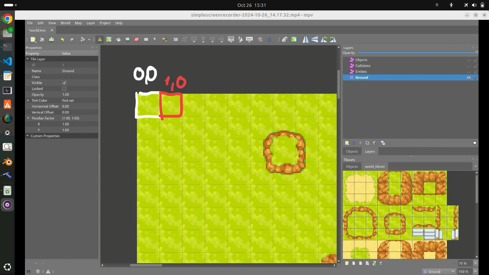
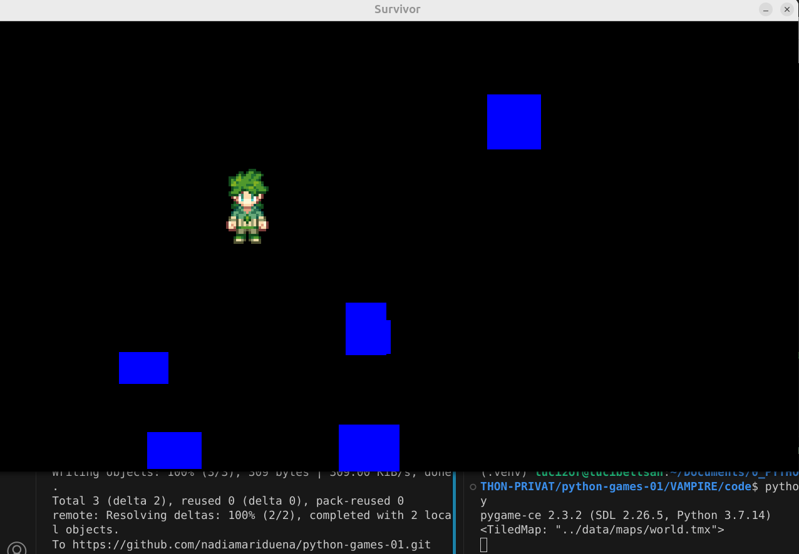
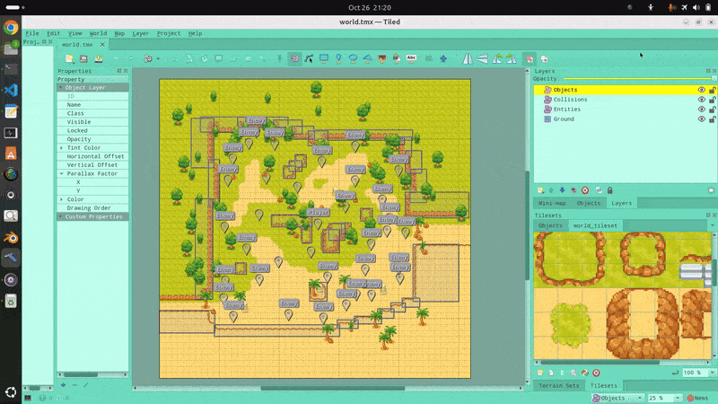

## 🟡 Vampire survivor

<br>
<br>

## 🟦 Intro


#### [4:20:28](https://youtu.be/8OMghdHP-zs?si=ePWx_BACyResw16v&t=15628)

<br>
<br>
<br>


## 🟦 Creating Levels with `Tiled`


### 🟠 Creating engaging levels is a key part of game development, and using a tile editor can streamline this process significantly.


>   In this lesson, we'll focus on using ✋ [Tiled/  mapeditor.org ](https://www.mapeditor.org/), a powerful and user-friendly tile `map editor`, to design levels for your Pygame projects. We'll explore why you need a tile editor, how to get started with Tiled, and how to import your tile maps into Pygame seamlessly.


<br>

## 🟠 Why Use a Tile Editor?

>#### When building a game level, having a visual representation of your design is crucial.


### 🟩 A tile editor allows you to:


**Visualize Your Design:** Place tiles and see how they come together in real-time, making it easier to tweak your layout.

**Efficiently Organize Tiles:** Use a grid system to manage your tiles, making it simpler to create complex environments without getting lost in code.

**Speed Up Development:** Quickly iterate on designs and test them without needing to dive into the code each time.


### 🟧 Introducing Tiled

#### Among the various tile editors available, Tiled stands out for its versatility and ease of use.

> #### You can download Tiled for free from [Tiled/  mapeditor.org ](https://www.mapeditor.org/).

It supports a range of features that make it suitable for both beginners and experienced developers.


### 🟢 Key Features of Tiled

**Layer Management:** Organize your tiles into layers for backgrounds, collisions, and foreground elements.

**Custom Properties:** Assign properties to tiles for better interaction with your game logic.

**Export Options:** Save your maps in a format that's easy to import into Pygame.


<br>

## 🟠 Importing Tile Maps into Pygame

### In this tutorial, we will specifically focus on how to import tile maps created in Tiled into Pygame.

> #### 🔴 While we won't delve into designing maps, understanding how to integrate them into your game is essential for creating immersive levels.

<br>


## 🟠 Resources for Further Learning

#### To enhance your understanding of tile maps and how to work with them in different engines, check out these helpful tutorials:

<br>

- [A guide to level creation with Tiled [ + how to use it with pygame ]](https://www.youtube.com/watch?v=N6xqCwblyiw&ab_channel=ClearCode)

<br>

#### Other:

[Use the TileMap to Make Incredible Maps & Levels for your Godot Games](https://youtu.be/rckLxmH_fK0?si=zne4yC7x3mpkTkCf)

[How to Use the New TileMap in Godot 4](https://youtu.be/tQSL2scuqeU?si=nZyaE7TlClHn5Xms)

[How to build a Tile Set Map Editor using HTML Canvas](https://youtu.be/IYgZMIB7_PM?si=Vn9hG-S4vnEq9ekb)

<br>

---


<br>
<br>
<br>

## 🟡 1. Installing Tiled via the Terminal


#### If you've faced issues downloading Tiled from the official website, a reliable alternative is to install it through the `terminal` using Snap.

🔴 This method is straightforward and helps avoid potential errors.

### Here’s how to do it:


#### 🔶 a: Install Tiled
To install Tiled, simply open your terminal and run the following command:

```python
sudo snap install tiled
```

#### 🔶  b: Launch Tiled

Once the installation is complete, you can run Tiled by typing:

```python
tiled
```
#### 📌 Pin Tiled to Your Desktop (optional)

For quick access, you may want to pin Tiled to your desktop or taskbar. This can typically be done by right-clicking the Tiled icon in your applications menu and selecting the option to pin it.


<br>
<br>

## 🟡 2.  Customizing the Editor Background Color and Tile Colors

#### One of the first steps in personalizing your workspace in Tiled is adjusting the editor's background color and tile colors. This can enhance visibility and make your design process more enjoyable.

### 🟢 Changing the Background and Tile Colors

🌈 **In the image below**, you can see that I have already made some adjustments to the settings. Customizing these colors can help you better visualize your project as you work.

### 🟢 Project Structure Overview

As you **customize your settings**, you’ll also notice a glimpse of the project structure. While the tile map has been created by the instructor, you have the option to build one from scratch.


<br>

### 🟧 Create your own tile map

If you want to learn how to create your own tile map, check out the video:[A guide to level creation with Tiled [ + how to use it with pygame ]](https://www.youtube.com/watch?v=N6xqCwblyiw&ab_channel=ClearCode). **It provides** helpful insights on using Tiled with Pygame


<br>

[]()

>I already edited the colors of my editor

<br>
<br>

<br>
<br>

# 🟫 Important Points

 I’ll highlight the key aspects here, but please **watch the video tutorial** as the teacher will give a quick introduction to tile maps.

 <br>


# 🟧 Understanding the Project with the `World.tmx` File

 When you look at the map tiles, keep these points in mind:


### 🟤 Positioning:

- - Each tile has an `X` position and a `Y` **position**.

-  - The surface of the tile **can be different at the edges**.

- - **For example**, a tile may be fully grass, but at one corner, it could overlap with a rock.


### 🟤Grid System:

-  - The grid doesn’t use pixel coordinates, so we need to convert our positions accordingly.

<br>
<br>

# 🟧 Tile Positions on the Grid

## 🟤 In the grid:

### The tile at the very top left corner has the position (0, 0).

If you move to the tile directly to the right of it, the position changes to (1, 0).

[]()


### 🔴This means:

- - **The first number (X)** increases as you move right.

>-  - -  the first tile at the top , has the position of 0,0, if you go to the right of this tile 1 (lets say the second tile to the right), the number would be 1,0


- - **The second number (Y)** stays the same if you’re only moving horizontally.


> ### Remember, as you navigate the grid, the positions are defined by their distance from the origin point (0, 0).

<br>


<br>
<br>
<br>

---

<br>

# 🟡  Importing Your Grid Map into Pygame: Let's Get Started!

### Whether you want to create a stunning platformer or an adventurous RPG, importing your grid map is the first step!


### 🟦 Let’s dive into two ways to do this.

<br>

### 🟤 Method 1: Importing with a CSV File

#### You can use a CSV (Comma-Separated Values) file to import your grid map.

- - 🔴 While this method works, it can be quite tedious(it can feel a bit like a puzzle with too many pieces).

- - #### It involves a lot of manual setup and can be quite time-consuming.Picture yourself meticulously arranging each tile—definitely a lot of work!


<br>

### 🟤 Method 2: Discover the Power of Pytmx!

#### Instead of wrestling with CSV files, let’s use the super handy `pytmx module`.

- - #### This tool makes loading TMX files (the cool format for tile maps) into Pygame easy!  ✨


### 🌈 Installation


**Step 1:** Install `Pytmx`

- Open your terminal (or command prompt).

Type this command and hit Enter:

```python
pip install pytmx
```


<br>


---

<br>
<br>
<br>


## 🟦 Lets start coding

### We’ll use the `pytmx module` to `load a tile map` into our Pygame project. Let’s break it down step by step.


<br>

## 🟡 1: Import Pytmx


**First,** we need to import the necessary function from `pytmx`. This function will help us load our map file.


```python
from pytmx.util_pygame import load_pygame
```

<br>
<br>

## 🟡 2: Create a Setup Method in the Game Class

**Next**, we’ll **create a new method** in your `Game` **class** called `setup()`.

> #### This method will be responsible for loading our map.

Here’s how to do it:

```python
def setup(self):
    map = load_pygame()
```
#### This method currently just loads a map, but we’ll add more details in the next steps!


<br>
<br>


## 🟡 3: Import the `TMX File`


**Now**, let’s import your TMX file.

>#### It’s important to specify the correct path to your map file so that Pygame knows where to find it.

Here’s the code to load your map file correctly:

```python
def setup(self):
    map = load_pygame('../data/maps/world.tmx')
    print(map)

```

> #### 🔴 Important! The `../` in the path means “go up one folder.” If the path is incorrect, you might get an error or not see anything on the screen.

#### The `print(map)` line is helpful because it lets you see if the map loaded correctly in the console.


<br>
<br>

## 🟡 4: Call the Setup Method

**Finally**, we **need to call our `setup` method** so it runs when the game starts.

- - 🌟 Add **`self.setup()`** in your `__init__` method like this:


```python
class Game:
    def __init__(self):
        pygame.init()
        self.display_surface = pygame.display.set_mode((WINDOW_WIDTH, WINDOW_HEIGHT))
        pygame.display.set_caption('Survivor')
        self.clock = pygame.time.Clock()
        self.running = True

        # --- SETUP ------
        self.all_sprites = pygame.sprite.Group()
        self.collision_sprites = pygame.sprite.Group()

        # 🟡 Call the setup method here
        self.setup()

```

- the current code


```python
class Game:
    def __init__(self):
        # Initialize all pygame modules
        pygame.init()


        # --- SETUP ------
        # Create a display surface with the specified window dimensions
        self.display_surface = pygame.display.set_mode((WINDOW_WIDTH, WINDOW_HEIGHT))
        # Set the title of the game window
        pygame.display.set_caption('Survivor')
        # Create a clock to manage the game's frame rate
        self.clock = pygame.time.Clock()
        # Initialize a running flag to control the game loop
        self.running = True
        # --- SETUP ------

        # GROUPS
        # group 1
        self.all_sprites = pygame.sprite.Group()
        # blue cube instances
        # group 2
        self.collision_sprites = pygame.sprite.Group()

        self.setup()

        # SPRITES
        # player
        # This line below creates an instance of the Player class and adds it to the self.all_sprites group, allowing it to be managed alongside all game objects.
        self.player = Player((400, 300), self.all_sprites, self.collision_sprites)

        # random blue cubes
        for i in range(6):
            x, y = randint(0, WINDOW_WIDTH), randint(0, WINDOW_HEIGHT)

            # Random width and height for the cubes
            w, h = randint(60, 100), randint(50, 100)  # Different sizes each time

            # Create a collision sprite
            CollisionsSprite((x, y), (w, h), (self.all_sprites, self.collision_sprites))
            # By passing self.collision_sprites as an argument, the player gains access to the collision detection logic without being a direct member of that group. This allows the player to check for potential collisions with other sprites while not being included in the collision checks themselves.

    def setup(self):
        map = load_pygame(join('../data/maps/world.tmx'))
        print(map)
```

<br>
<br>


## 🟡 5: Run the Code

### Now it’s time to run your code! You might notice that nothing seems to change on the screen;

- - you’ll still see your player and some blue rectangles.

<br>

[]()


<br>

> #### But don’t worry! If you check the ✋ CONSOLE, you should see something like this:

```python
<TileMap: "data\maps\world.tmx">
```

🔴 If you see something different, there’s likely an issue with how the map is loading.


<br>
<br>

## 🟡 6: Accessing Individual Layers

**Next**, we want to access the individual layers of the map.

> #### Each layer can contain different elements like the `ground, objects, and collision areas`.

Use this code to load your map:

```python
map = load_pygame('../data/maps/world.tmx')

```

### 🍊 In your map editor, you’ll notice a Layers bar showing different layers like Objects, Collisions, and Entities.

> - ### This is where you can manage what appears on the map!

[]()


<br>
<br>


## 🟡 Step 7: Accessing the Objects Layer

 Within the `setup()`:

### 🔴To access a specific layer, like the Objects layer, we’ll need to use a `for` loop, but first lets check how we are going to reach the Object

```python
map.get_layer_by_name('Objects')
```

The **Objects** layer includes trees, rocks, pillars, and other items.

>#### You can find these in your project folder under the data folder as well.


<br>
<br>

## 🟡 8: Loop Through the Objects

### `For` loop

**Now** let’s create a loop to go through all the items in the Objects layer:


```python
# This allows us to go through each item in that layer one by one. Here’s how to do it:
for obj in map.get_layer_by_name('Objects'):
    print(obj.x)
    print(obj.y)
    print(obj.image)

```


#### This will print the `x and y` positions, as well as the image for each object in the console.


```python
    def setup(self):
        map = load_pygame(join('../data/maps/world.tmx'))

        for obj in map.get_layer_by_name('Objects'):
            print(obj.x)
            print(obj.y)
            print(obj.image)

    def run(self):
```

<br>
<br>


## 🟡 9: Run the Code Again


### 🔴 After running the code, you’ll see that the game screen still looks the same. However, your console should be filled with a lot of data!

#### But what is this data?

>The data includes the `x and y` coordinates and the image of each object.

[]()


<br>

### Now, let’s learn how to turn this data into a 💥 Sprite 💥!

<br>
<br>

<br>

---

## 🟡 10: Modify the Collision Object

#### You already have a `Collisions` object defined in `sprites.py`.


- - #### Let’s modify it to use the objects from your map instead of just drawing blue rectangles.

Here’s how to update it:

🟤 **Replace** the size parameter with surf (which will represent the surface image).

🟤 **Change** the way you set `self.image`. Instead of creating a blue block, use the surf you just added:

```python
self.image = surf
```
🟤**Remove** the line that fills the screen with blue:

```python
self.image.fill('blue')
```
### 🟢 Your modified `CollisionsSprite` class should look like this:


```python
class CollisionsSprite(pygame.sprite.Sprite):
    def __init__(self, pos, surf, groups):
        super().__init__(groups)
        # Now it shows the objects like trees, rocks, etc.
        self.image = surf
        self.rect = self.image.get_rect(center=pos)

```

>### 🔴 Before running the code, let's continue to remove and modify a couple of things

<br>
<br>
<br>

## 🟡 11: Remove the Creation of Blue Boxes

- The Goal in this step, is to **replace** the creation of the **six blue boxes** with a `CollisionSprite` that utilizes the actual objects from the tile map.


> 🔴 **Remember** that in **Step 10**, we **modified** the `CollisionSprite` class **to use** `surf` **instead of** `size`, 🔺 allowing us to display the real game elements.


###  Now that we're ready to utilize the actual objects from our tile map (like trees and rocks), it's time to remove the code that generates blue boxes.

<br>

### Code to Remove

- Within the `main.py` in your **Game class**


- **Locate and delete** the following block of code:

<br>

```python
for i in range(6):
            x, y = randint(0, WINDOW_WIDTH), randint(0, WINDOW_HEIGHT)

            # Random width and height for the cubes
            w, h = randint(60, 100), randint(50, 100)  # Different sizes each time

            # Create a collision sprite
            CollisionsSprite((x, y), (w, h), (self.all_sprites, self.collision_sprites))
            # By passing self.collision_sprites as an argument, the player gains access to the collision detection logic without being a direct member of that group. This allows the player to check for potential collisions with other sprites while not being included in the collision checks themselves.

```

<br>

## Explanation of What This Code Does


#### 🟩 Random Generation:

#### This loop generates six random positions on the screen within the game window dimensions `(WINDOW_WIDTH and WINDOW_HEIGHT)`.


>- - #### 🌈 It also creates random width and height values for the blue boxes, which vary with each execution.

#### 🟩 Creating Collision Sprites:

- The `CollisionsSprite` **class** is instantiated with these random coordinates and sizes, adding blue 🧊 rectangles to the game.


- The collision groups `(self.all_sprites and self.collision_sprites)` are used for managing and detecting collisions with other game objects.


### Why Remove This Code?

**Focus on Actual Game Objects:**


#### We want to replace them with meaningful game objects from our tile map, enhancing the gameplay experience.

**Collision Detection:** By using objects from the tile map, we can leverage their built-in properties for collision detection without cluttering the game with unnecessary placeholder graphics.

<br>

## 🟧Next Steps

#### After you remove this block, we'll implement a new loop to create collision sprites <u>using the actual objects defined in your TMX file</u>.


<br>
<br>

## 🟡 12: Adding CollisionSprite to the Setup Method


### After removing the loop that created the six blue boxes, we need to insert the `CollisionSprite()` into the `setup()` method.


> - ### The <u>purpose of the setup()</u>  method is to initialize and set up important game elements, including our collision sprites.

### 🟤 1. First Argument: Position

The first argument for `CollisionSprite()` is the position of the sprite, which requires coordinates **(x, y)**.

#### Here’s how to set it up:


```python
# 1 How it should look:
CollisionsSprite(size)
# 2 but in the code
CollisionsSprite(obj.x, obj.y)
```
#### this 2 arguments  `obj.x, obj.y` needs to be in a tuple:

```python
CollisionsSprite((obj.x, obj.y))
```

#### Why a Tuple?

We use a tuple (the parentheses around the coordinates) to group the x and y values together as **a single argument**. This makes it clear that the two numbers represent a single position in the game world.


<br>

### 🟤 2. The second argument: Argument: Image

- The second argument is the image of the sprite, which determines how it looks on the screen.


```python
# 1 this is how it should look
CollisionsSprite(size, image)
# 2 but in the code
CollisionsSprite((obj.x, obj.y), obj.image, )
```

>**Recall** from Step 10: In that step, we replaced size with surf. This means we’re now using the image associated with the object from the tile map instead of a fixed size for the sprite.


<br>

### 🟤 3. Third Argument: Sprite Groups

The third argument needs to be a tuple containing the groups: `(self.all_sprites, self.collision_sprites)` that this sprite belongs to.


```python
CollisionsSprite((obj.x, obj.y), obj.image, (self.all_sprites, self.collision_sprites))
```
>This helps manage how sprites are rendered and how collisions are detected.


### Purpose of These Groups:

