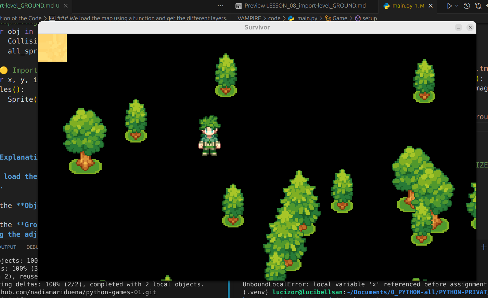
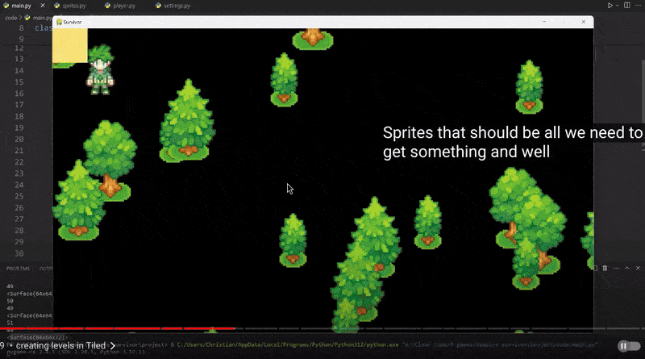
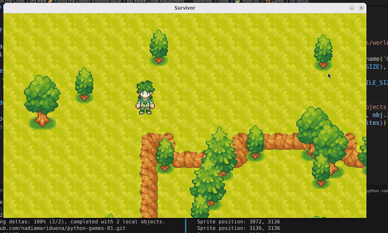

## 🟡 Vampire survivor

<br>
<br>

## 🟦 Intro

#### [4:33:11](https://youtu.be/8OMghdHP-zs?si=MkVcgh_CaH65GV7K&t=16391)

<br>
<br>

# 🟡 1: Import the Ground Layers

<br>

🟫 **In this step**, we'll continue **expanding the game** world by **importing the ground layers** <u>from our **tile map**</u> .


### 🍏 After successfully adding the trees 🌳, it's time to integrate the rest of the objects, which will enhance the game's environment.

<br>

## 🟤 Importing the Ground  Layer

#### To access the ground layer from your tile map, use the following line of code:


```python
map.get_layer_by_name('Ground')
```

<br>

## 🟤 Adding `.tiles()`

✋ **Next**, we’ll **add `.tiles()` to the line** above to **retrieve the individual tiles** within the ground layer.

 > #### This will allow us to work with each tile's position and image.

```python
map.get_layer_by_name('Ground').tiles()

```


### 🟪 Why Use .tiles()?

**The purpose of `.tiles()`** is **to access the individual tiles** in the **ground layer**.

> 🔴This method **allows us to retrieve not just the layer itself, but also the specific tiles**, making it easier to manipulate them within our game.


<br>
<br>

## `Loop`

## 🟡 2: Using a Loop to Process `Tiles`

- **Now** we need to insert the above line inside a **loop to process each tile.**

```python
for x, y, image in map.get_layer_by_name('Ground').tiles():
```

<br>
<br>

## 🟡 3:  Printing Tile Data

After setting up the loop, let’s print the details of each tile to the console:

```python
for x, y, image in map.get_layer_by_name('Ground').tiles():

    print(x)
    print(y)
    print(image)

```
### 🟠 Expected Output

[4:33:41](https://youtu.be/8OMghdHP-zs?si=Uy4X1dKhCVL5odQt)


- #### 🌈 If you look at the console, you'll see a significant amount of data being generated, which is a positive sign! The next step is to implement sprites that do not trigger collisions.

<br>

>  When you run this code, you’ll see output similar to this in your console:

```python
# This is just a part of all the data I have in the console
43
<Surface(64x64x32)>
30
43
<Surface(64x64x32)>
31
43
```


<br>

<br>

## 🟠 Understanding the Output


### 🟢 `Surface(64x64x32)`:

> #### 🔺 This indicates a tile or sprite surface that is 64 pixels wide, 64 pixels high, and has a depth of 32 bits (often for color depth).

- - - #### 🔺 These <u>indices</u>  are multiplied by 32, which refers to the tile size.


### 🟢 Tile Indices `(30, 31, 43)`:

These numbers represent specific tiles in your tile map.

> - - #### If the numbers represent X and Y positions, you can calculate the pixel positions by multiplying the indices by the tile size (64 pixels).

<br>


## 🟫 Example Calculations

### If you have:

- - 🟤 **Index 30** (assuming this is `X`):

- - - Pixel X Position: **30 * 64 = 1920**

- -  🟤 **Index 43** (assuming this is `Y`):

- - - Pixel Y Position: **43 * 64 = 2752**

### So, if both indices refer to positions in your grid, the pixel coordinates would be (1920, 2752).


<br>
<br>


<br>
<br>

## 🌈 1. Tile Grid with Indices

Below is the updated grid representation, including the specified tile indices.

```python
| 0,0  | 1,0  | 2,0  | 3,0  | 4,0  | 5,0  |
|------|------|------|------|------|------|
| 0,1  | 1,1  | 2,1  | 3,1  | 4,1  | 5,1  |
|------|------|------|------|------|------|
| 0,2  | 1,2  | 2,2  | 3,2  | 4,2  | 5,2  |
|------|------|------|------|------|------|
| 0,3  | 1,3  | 2,3  | 3,3  | 4,3  | 5,3  |
|------|------|------|------|------|------|
| 0,4  | 1,4  | 2,4  | 3,4  | 4,4  | 5,4  |
|------|------|------|------|------|------|
| 0,5  | 1,5  | 2,5  | 3,5  | 4,5  | 5,5  |


```

## 2. 🌈 Adding Indices

### Now, let’s place the tile indices `(30, 31, 43)` within the context of the grid.

**For this example**, we'll **assume these indices are part of a larger grid** where the indices relate to specific rows and columns:

**Index 30:** This could be represented as being in row 5, column 0 (0-based indexing).

**Index 31:** This would be in row 5, column 1.

**Index 43:** This would be in row 6, column 3.


<br>

## 🌈 3. Updated Grid with Indices
Here’s how it looks:

```python
| 0,0  | 1,0  | 2,0  | 3,0  | 4,0  | 5,0  |
|------|------|------|------|------|------|
| 0,1  | 1,1  | 2,1  | 3,1  | 4,1  | 5,1  |
|------|------|------|------|------|------|
| 0,2  | 1,2  | 2,2  | 3,2  | 4,2  | 5,2  |
|------|------|------|------|------|------|
| 0,3  | 1,3  | 2,3  | 3,3  | 4,3  | 5,3  |
|------|------|------|------|------|------|
| 0,4  | 1,4  | 2,4  | 3,4  | 4,4  | 5,4  |
|------|------|------|------|------|------|
| **30** | **31** | 2,5  | 3,5  | 4,5  | 5,5  |
|------|------|------|------|------|------|

```


### 🔴If you're using these indices to render tiles on your screen, remember to ensure they fit within your window dimensions (1280x720) and adjust your game logic accordingly.

> #### If any index exceeds the number of tiles that can fit in the visible area, you may need to handle that by either scrolling the view or limiting the number of tiles drawn.

<br>
<br>


<br>
<br>
<br>

[4:34:05](https://youtu.be/8OMghdHP-zs?si=hC_cN3YGOKKzxTem&t=16445)

## 🟡 4: Creating Non-Collisional Sprites


### In this step, we will create a new type of sprite specifically for the ground elements in our game.

> - ✋ These **sprites will not interact with the player**, meaning **they won’t trigger any collision events**.


<br>

### 🟫 Defining the Sprite Class

To achieve this, we’ll create a **new class** in `sprites.py`.

- This class will be based on the `pygame.sprite.Sprite` **class**.

```python
class Sprite(pygame.sprite.Sprite):
    def __init__(self, pos, surf, groups):
        super().__init__(groups)
        self.image = surf
        self.rect = self.image.get_rect(center=pos)

```

<br>
<br>
<br>


## 🟦 Before Moving On

- Remember that we have the below code in our `settings.py`, we will be using this when multiplying (in the next steps)

```python
WINDOW_WIDTH, WINDOW_HEIGHT = 1280,720
TILE_SIZE = 64
```
🔴 This value will be essential for scaling your game objects appropriately.

<br>
<br>
<br>
<br>

## 🟡 5: Adding the new `Sprite` class to the Game

### 🟫 Now that we have our Sprite class, <u> we need to create an instance of this sprite</u> in the game.

> This will allow us to display a ground sprite on the screen.


## 🟢 Creating a Sprite Instance

#### [4:35:00](https://youtu.be/8OMghdHP-zs?si=qagyPW0D_WbJxZ7j&t=16500)

### We’ll add the `Sprite` instance within the `setup` method of our game class.

- 🔴 **Warning** there will be an issue with this approach, we will check this later.

- Under the **Objects** `for` loop, **add** the following

```python
Sprite((x, y), image, self.all_sprites)
```
<br>


### Putting it all together:

```python
def setup(self):
    map = load_pygame(join('../data/maps/world.tmx'))
    # Importing the trees
    for obj in map.get_layer_by_name('Objects'):
        CollisionSprite((obj.x, obj.y), obj.image, (self.all_sprites, self.collision_sprites))

    # 🟡 Importing the Ground Layer
    for x, y, image in map.get_layer_by_name('Ground').tiles():
        Sprite((x, y), image, self.all_sprites)

```
### What is happening here:

 We load the map using a function and get the different layers.

- For the **Objects** layer, we create collision sprites.

- For the **Ground** layer, we create ground sprites **using the adjusted positions multiplied** by **TILE_SIZE** (`64` in this case).


 <br>

 ## 🟠 Run the code

[]()


## 🟠 Output


- 🟤 You should see a single yellow 🟨 tile (sprite) positioned at the top-left corner of the game window.


## 🔴 Why Direct Access Is Problematic

### it’s important to understand why it’s not ideal to access the coordinates directly:

```python
for x, y, image in map.get_layer_by_name('Ground').tiles():
    Sprite((x, y), image, self.all_sprites)
```
### Issue with Player Proximity 👬

When the player approaches the sprite, they might get too close, almost appearing inside it.

> - #### 🔺 This issue arises because we are using the grid coordinates directly, which are too small for our tile size.

<br>

## 🟩 Understanding the Issue

### To clarify, the small numbers represent tile indices on the grid.

**For example**, if we use **(0, 0)** for the first tile, it refers to the grid position but does not account for the actual pixel size of the tiles.


## 🌈 Solution:

### 🟤Adjusting Tile Positions

#### Explanation of Tile Positioning

- To fix the proximity issue, **we need to multiply the grid indices by the tile size (64 pixels)**.

<br>

- - - **First Tile:** The position `(0, 0)` corresponds to the pixel position (0, 0), but the width and height are both `64` pixels.

- - - **Second Tile:** The next tile at `(1, 0)` has its left edge at `(64, 0)` because it occupies the space of one tile width.


[]()

<br>
<br>

## 🟡 6: Multiply the `x and y` coordinates by `TILE_SIZE`

### To correctly position the tiles in the game, you will `multiply the x and y coordinates by TILE_SIZE` when creating the sprite:


```python
Sprite((x * TILE_SIZE, y * TILE_SIZE), image, self.all_sprites)
```

#### To visualize this, you can print the sprite positions to the console:

```python
print(f"Sprite position: {x * TILE_SIZE}, {y * TILE_SIZE}")
```


<br>


### Putting it all together

```python
    def setup(self):
        map = load_pygame(join('../data/maps/world.tmx'))
        for obj in map.get_layer_by_name('Objects'):
            CollisionsSprite((obj.x, obj.y), obj.image, (self.all_sprites, self.collision_sprites))


        # 🟡 importing the trees
        for x,y, image in map.get_layer_by_name('Ground').tiles():
            Sprite((x * TILE_SIZE,y * TILE_SIZE), image, self.all_sprites)

            print(f"Sprite position: {x * TILE_SIZE}, {y * TILE_SIZE}")

```

 <br>


## 🟡 7:  Run the Code


### Observing the Changes

🟤 **Full Coverage of the Game Window:**

You’ll notice that the **tiles now cover the entire game window**.

> This is because the tile positions are now accurately calculated using the tile size.


<br>

### 🔴 Disappearance of Objects 🌳

#### You may see that the object trees have disappeared from the screen.

> #### This happens due to the order of the code execution.


<br>

### 🌈 Fixing the Object (trees) Visibility Issue

The disappearance of the trees is related to the order of the sprite creation lines.

>**To resolve this**, you should **move** the Sprite line for the ground tiles **above** the `CollisionsSprite` line for the objects.

#### Code Adjustment


```python
# the correct positioning

        for x,y, image in map.get_layer_by_name('Ground').tiles():
            Sprite((x * TILE_SIZE,y * TILE_SIZE), image, self.all_sprites)

        for obj in map.get_layer_by_name('Objects'):
            CollisionsSprite((obj.x, obj.y), obj.image, (self.all_sprites, self.collision_sprites))

```


[]()


<br>
<br>

<br>

## 🟡 8: Object Alignment Issues in Game Development


### In this step, we will address the alignment problems observed in the game.

